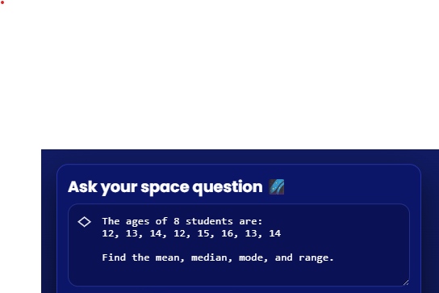
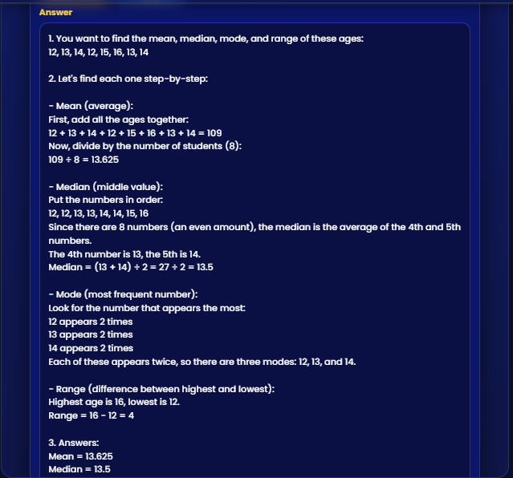

# 🌌 MathsBrain Galaxy

**MathsBrain Galaxy** is an AI-powered interactive learning assistant for kids 🚀.  
It helps children solve math problems in a fun, cosmic interface — guided by an AI tutor bot!

---

## ✨ Features

- 🤖 **AI-powered Math Tutor** — Ask any math question and get step-by-step help.
- 🎨 **Kid-friendly Galaxy UI** — Bright colors, floating math symbols, glowing gradients.
- 🧩 **Responsive Design** — Works beautifully on desktop, tablet, and mobile.
- 💬 **Interactive Robot Mascot** — A friendly AI guide floats beside your question box.
- 🔒 **Secure Architecture** — The OpenAI API key is safely stored in the backend, never exposed.

---

## 🖼️ Screenshots

| Homepage | Ask Section | AI Response |
|-----------|-------------|--------------|
|  |  |  |

> 💡 Create a folder called `screenshots` in your project root and drop the images there.

---

## 🧩 Tech Stack

| Layer | Technologies |
|-------|---------------|
| **Frontend** | React + Vite + TypeScript + Custom CSS Galaxy Theme |
| **Backend** | Node.js + Express + TypeScript |
| **AI Integration** | OpenAI API (text completions) |
| **Data** | Power BI, PostgreSQL, Snowflake |
| **Hosting (Optional)** | Render / Railway / Vercel |

---

## ⚙️ Local Setup

### 1️⃣ Clone the project
```bash
git clone https://github.com/vamshi-attla/mathsbrain-galaxy.git
cd mathsbrain-galaxy
```

### 2️⃣ Install dependencies
```bash
cd server && npm install
cd ../client && npm install
```

### 3️⃣ Add your `.env` file in `server/`
```bash
OPENAI_API_KEY=sk-xxxxxx
PORT=4000
```

### 4️⃣ Start development servers
Run backend:
```bash
cd server
npm run dev
```

Run frontend:
```bash
cd client
npm run dev
```

Open browser → [http://localhost:5173](http://localhost:5173)

---

## 💼 About the Author

### **Vamshi Krishna Reddy Attla**
📍 *Melbourne, Florida*  
📧 [vamshi061102@gmail.com](mailto:vamshi061102@gmail.com)  
📞 (321) 381-1351  
🎓 Master’s in Computer Science, Florida Institute of Technology — May 2025

**Data/BI Analyst** specializing in SQL, Spark, Snowflake, dbt/Airflow, and Power BI/Tableau.  
Built analytics solutions for supply chain, e-commerce, and healthcare domains, improving operations, costs, and insights.  

**Technical Skills:**  
Power BI · Tableau · Snowflake · Airflow · dbt · Spark · SQL · Python · AWS · GCP · Kafka · Terraform · Jenkins

**Highlighted Projects:**  
- **Supply Chain Ops Analytics** – Built dashboards and dbt pipelines cutting runtime by 41%.  
- **HIPAA-Ready Dental Claims Lakehouse** – Reduced data-quality incidents by 50%, automated claim ingestion by 85%.  
- **Real-Time Feature Store** – Delivered low-latency recommendation features improving add-to-cart rates by 5%.  
- **Team Collaboration App** – Full-stack Java + React web app with AWS deployment.

---

## 🚀 Roadmap

- [ ] Add voice-based question input 🎙️  
- [ ] Deploy backend on Render with environment variables  
- [ ] Add progress tracking and quiz system  
- [ ] Gamify with XP and badges 🌟  

---

## 🧠 Author Links

- [LinkedIn](https://linkedin.com/in/vamshi-attla)
- [GitHub](https://github.com/vamshi-attla)
- [Portfolio](#)

---

## 🪐 License

MIT © 2025 MathsBrain Galaxy
